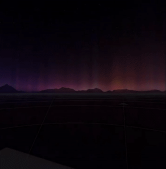
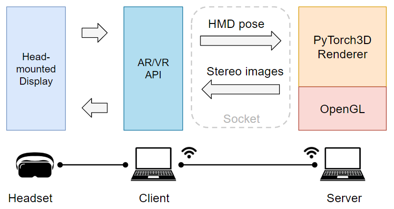

# PyTorch3D VR Viewer
This experimental repository aims to develop a customizable VR neural rendering viewer written in Python for evaluating and developing neural rendering methods for VR. 

Mesh  | Point | Volume | Implicit
------ | ------|---------- | ------ 
     |       |    |   


## Pipeline
We adopt the popular [Pytorch3D](https://pytorch3d.org/tutorials/) as our renderer backbone, which provides convenient features to implement major differentiable neural rendering methods (e.g., NeRF). For VR data communication, we use [pyopenvr](https://github.com/cmbruns/pyopenvr), a python binding for Valve's OpenVR virtual reality SDK to keep the whole pipeline all in Python. While Pytorch3D may not be optimized for real-time performance, it can be replaced with any latest neural renderers given a Python interface.

The pipeline contains the following steps:
- Obtain camera parameters for left/right eyes and real-time HMD pose from OpenVR.
- Given the camera parameters and poses, render views via Pytorch3D.
- Submit the left/right views to HMD via OpenVR.

<p align="center">

</p>

## Installation
Install [SteamVR](https://www.steamvr.com/zh-cn/) and [Oculus App](https://www.meta.com/ch/en/quest/setup/) which are needed by OpenVR applications.

Create a conda environment.
```
conda create -n pytorch3d_vr python=3.9
conda activate pytorch3d_vr
```

Install pyopenvr, pyglfw, and pyopengl.
```
pip install openvr glfw PyOpenGL PyOpenGL_accelerate
```
Install PyTorch3D. More details can see [here](https://github.com/facebookresearch/pytorch3d/blob/main/INSTALL.md).
```
conda install pytorch==1.10.0 torchvision==0.11.0 cudatoolkit=11.3 -c pytorch -c conda-forge
conda install -c fvcore -c iopath -c conda-forge fvcore iopath plotly
```
Install other dependencies.
```
pip install matplotlib opencv-python open3d numpysocket
```

## Usage
As running OpenVR and Pytorch3D on the same GPU is likely to reach the GPU memory limit and significantly slow down the rendering speed, we provide two modes for small-memory GPU cases.
- *All-in-One mode*: Running OpenVR and Pytorch3D renderer on the same machine (single GPU). This is suitable when the Pytorch3D GPU usage is small (e.g., point/mesh renderers) or the GPU memory is big enough.
- *Client-Server mode*: Running OpenVR on one machine and Pytorch3D renderer on the other machine (two GPUs). This is suitable when the GPU memory is small or the renderer is running on the remote cluster. We transfer data using Socket. 

For *All-in-one* mode, we tested it on a single GeForce RTX 3060 Laptop (6GB). For *Client-Server* mode, we tested it with the server running on GeForce RTX 3060 Laptop (6GB) and the client running on GeForce RTX 2060 Laptop (6GB). In this case, the volume render and implicit renderer can only be run in *Client-Server* mode.

### All-in-One mode
Firstly, open the Oculus Quest 2 and connect to the PC with Oculus-Link or Oculus-Air-Link. Then simply run
```
python run_glfw.py [--actor ACTOR]
```
We currently support default Pytorch3D renderers, including mesh, point, volume, and implicit renderers.

### Client-Server Mode
Similarly, make sure the Oculus Quest 2 is connected to the client machine with Oculus-Link or Oculus-Air-Lnik. Additionally, find out the IP address of the server machine (the one running the actor) and make sure it is accessible from the client.

On the server machine, start an actor in remote mode by running on a given port. For example, to run a mesh actor, we can use
```
python actor/pytorch3d_mesh_actor.py [--port PORT]
```
On the client machine, run
```
python run_glfw.py --actor remote [--host_ip HOST_IP] [--port PORT]
```
where HOST_IP and PORT is the server's IP address and port.

## Todo
- [X] Add default Pytorch3D renderers
- [X] Add support for client-server mode
- [ ] Solve the flashing problem for low FPS cases
- [ ] Optimize for speed (all ops on GPU)
